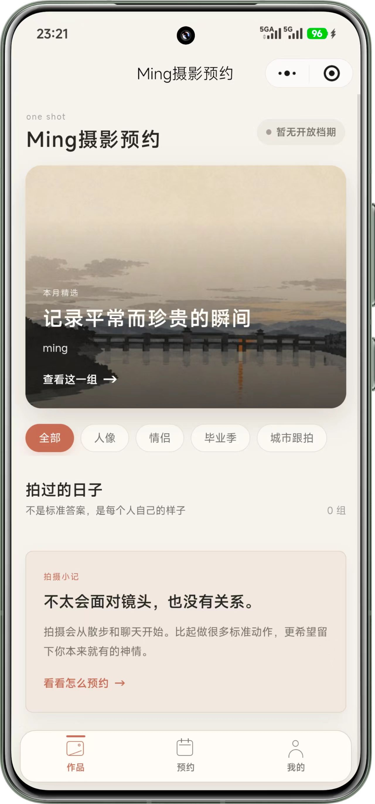
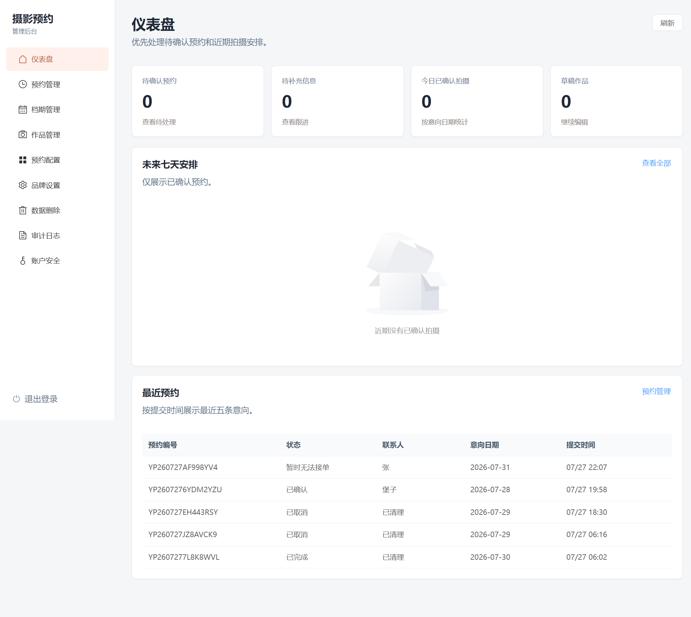
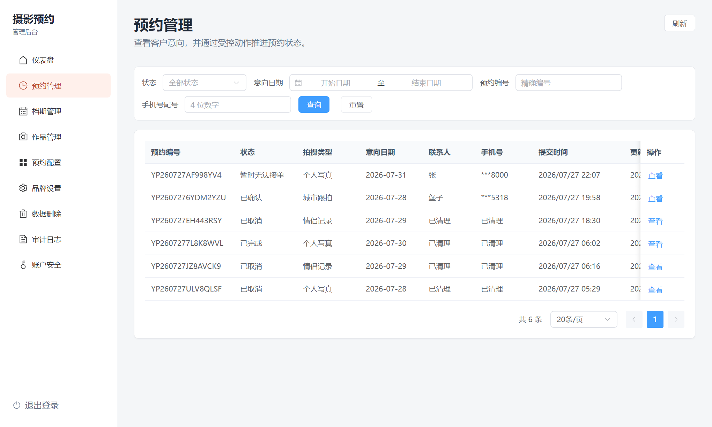

# 悦拍：摄影作品展示与预约系统

悦拍是一个面向个人摄影师的全栈示例项目：客户通过微信小程序浏览作品、查看档期并提交预约意向，摄影师通过独立的 Web 管理后台维护作品、预约和服务规则。

项目适合用来学习微信原生小程序、FastAPI、Vue 3、MySQL、Redis 和小型生产部署的组合方式。MVP 不接在线支付，预约由摄影师人工确认。

## 项目一览

| 部分 | 技术 | 作用 |
| --- | --- | --- |
| `miniprogram/` | 微信原生小程序、TypeScript、WXML、WXSS | 客户端作品展示、预约和个人数据操作 |
| `backend/` | Python 3.13、FastAPI、SQLAlchemy、Alembic | API、微信登录、预约业务和数据保护 |
| `admin-web/` | Vue 3、TypeScript、Vite、Element Plus | 摄影师管理作品、档期、预约和配置 |
| `deploy/` | Nginx、systemd、Shell、MySQL SQL | 生产部署、备份、恢复和健康检查 |
| `assets/` | PNG | 小程序和管理后台运行截图 |

## 当前界面

小程序首页使用真机运行截图：



后台页面，仅用于说明页面结构和数据形态：





## 功能范围

- 作品系列、分类、分页、详情和公开展示
- 服务品牌、政策和预约选项的后台配置
- 微信静默登录与服务端 Session
- 动态档期和三步预约表单
- 表单草稿、政策版本校验和幂等创建
- 我的预约、预约详情、修改和取消
- 个人数据删除申请与后台处理
- 预约状态流转、客户可见说明和审计日志
- Argon2id 管理员密码哈希、可选 TOTP、HttpOnly Cookie 和 CSRF 防护
- 图片上传校验、去除 EXIF、详情图和缩略图处理

## 快速开始

### 1. 准备配置

```powershell
Copy-Item .env.example .env
```

编辑根目录 `.env`，至少填写 MySQL、Redis 和微信 AppID/AppSecret。`.env`、私有项目配置、管理员凭据和本地媒体目录不会提交到 Git。

### 2. 启动后端

后端当前使用 Python 3.13：

```powershell
cd backend
py -3.13 -m venv .venv
.\.venv\Scripts\python.exe -m pip install -r requirements-dev.lock
.\.venv\Scripts\uvicorn.exe app.main:app --host 127.0.0.1 --port 8100 --reload
```

首次建库时，在空数据库执行 [`deploy/mysql/create.sql`](./deploy/mysql/create.sql)，之后使用 Alembic 迁移：

```powershell
.\.venv\Scripts\alembic.exe upgrade head
.\.venv\Scripts\python.exe -m app.cli.create_admin
```

详细后端说明见 [`backend/README.md`](./backend/README.md)，生产部署见 [`deploy/README.md`](./deploy/README.md)。

### 3. 启动管理后台

```powershell
cd admin-web
npm ci
npm run dev
```

打开 <http://127.0.0.1:5173/admin/>。Vite 会将 `/api` 请求代理到本地 `8100` 端口。生产构建使用：

```powershell
npm run build
```

### 4. 打开微信小程序

1. 安装微信开发者工具。
2. 导入仓库根目录，而不是单独导入 `miniprogram/`。
3. 在 `project.config.json` 中替换为你自己的 AppID。
4. 将后端地址配置为微信公众平台允许的 request、downloadFile 域名。
5. 编译 `miniprogram/` 并在模拟器或真机验证登录、作品和预约流程。

小程序的细节和发布检查见 [`miniprogram/README.md`](./miniprogram/README.md)。

## 测试与检查

```powershell
cd backend
.\.venv\Scripts\python.exe -m pytest
.\.venv\Scripts\python.exe -m ruff check app tests
.\.venv\Scripts\python.exe -m mypy app

cd ..\admin-web
npm ci
npm run test
npm run typecheck
npm run lint
```

小程序结构检查：

```powershell
.\scripts\check-miniprogram.ps1
```

## 仓库边界与安全

仓库提交源码、迁移、锁文件、部署模板、文档和 `.env.example`。以下内容默认忽略：

- `.env`、`*.local`、私有微信项目配置和管理员凭据
- `node_modules/`、Python `.venv/`、缓存、覆盖率报告和构建产物
- 本地数据库、运行日志、后端媒体目录和发布压缩包
- IDE 配置和系统生成文件

不要把 AppSecret、数据库密码、Session Token、TOTP Secret、加密密钥、真实客户手机号或原始媒体文件提交到仓库。若凭据曾经进入 Git 历史，应立即轮换，单纯删除当前文件不足以完成处置。

## 开源说明

这是一个可运行的个人摄影预约系统示例，不代表开箱即用的 SaaS 产品。使用时需要配置自己的 AppID、域名、密钥、品牌内容和数据，并完成微信备案、隐私协议、合法域名、HTTPS、备份恢复和真机回归检查。

本项目使用仓库根目录 [`LICENSE`](./LICENSE) 中的自有许可证。许可证允许个人使用和商业使用，但必须保留版权声明，并在使用本项目的小程序明显位置保留：`小程序作者：© ming woqiang0610@163.com`。

版权所有：`© ming woqiang0610@163.com`
